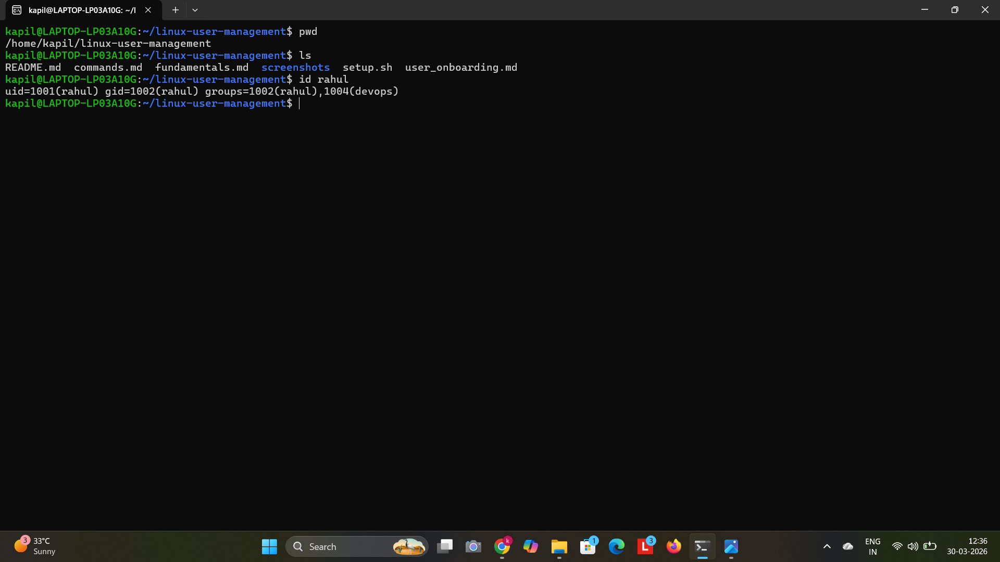
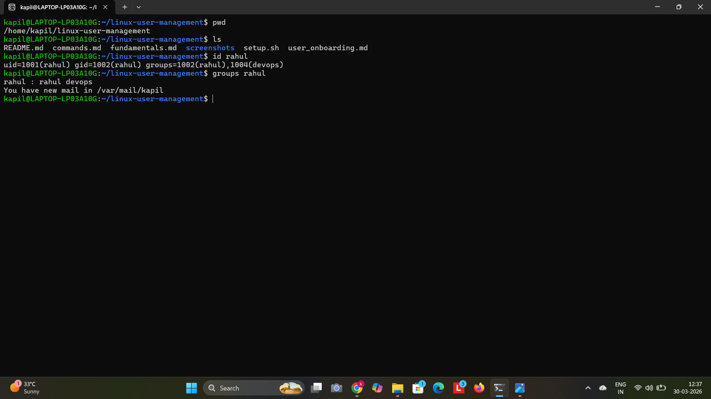
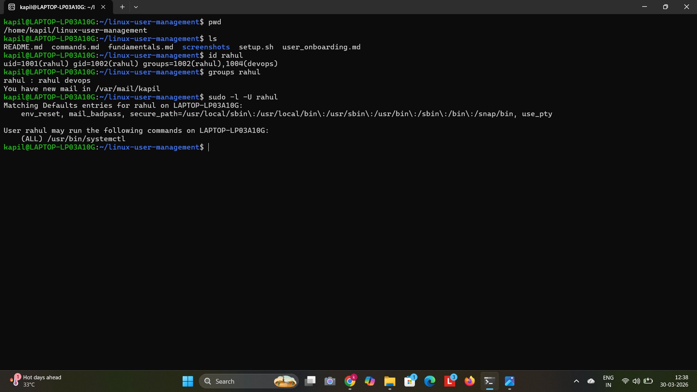
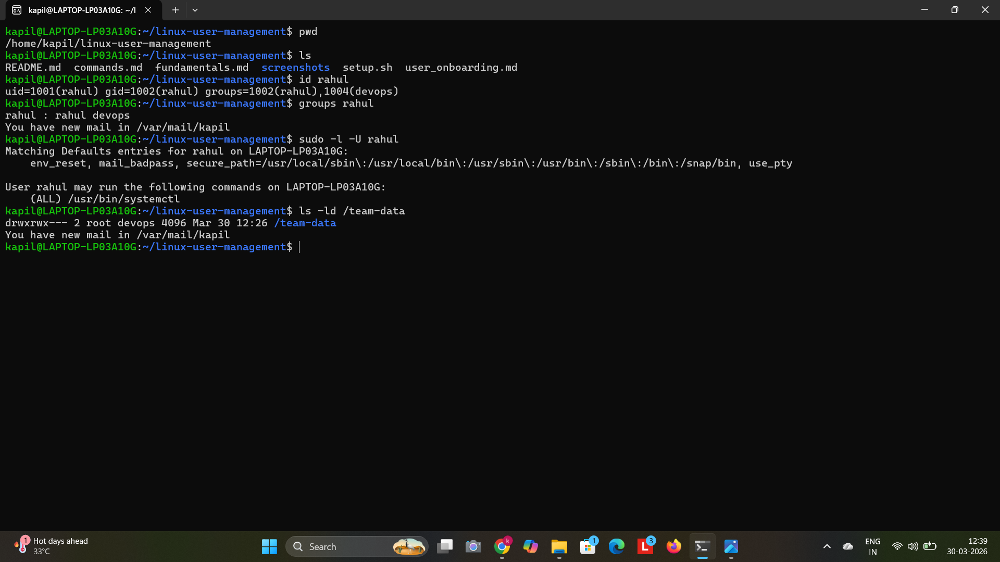

# 🐧 Linux User Management

A hands-on project demonstrating Linux user and group management, including user creation, group-based access control, shared directory setup, password policies, and controlled sudo access.

---

## 📂 Project Structure

```
linux-user-management/
│
├── README.md            # Project overview and usage
├── fundamentals.md      # Core concepts and key commands
├── user_onboarding.md   # Real-world onboarding scenario
├── commands.md          # List of commands used
├── setup.sh             # Automation script
└── screenshots/         # Output verification images
```

---

## 🚀 How to Run

```bash
# Clone the repository
git clone https://github.com/your-username/linux-user-management.git
cd linux-user-management

# Make script executable
chmod +x setup.sh

# Run with root privileges
sudo bash setup.sh
```

⚠️ This script must be executed as root or with sudo.

---

## 📌 What This Project Covers

* User creation with home directory
* Group creation and assignment
* Shared directory with group-based permissions
* Password expiry policy using `chage`
* Controlled sudo access
* Basic automation using shell script

---

## 🧪 Verification

```bash
id rahul
groups rahul
sudo -l -U rahul
ls -ld /team-data
```

---

## 📸 Output

### User ID



### Group Check



### Sudo Access



### Directory Permission



---

## 🧠 Concepts Practised

* Principle of Least Privilege
* Primary vs Secondary Groups
* Linux permission model (`chmod`, `chown`)
* Password aging and policy enforcement
* Secure sudo configuration

---

## 🌍 Real World Use Case

This project simulates onboarding users in a Linux-based production environment, ensuring proper access control, group-based permissions, and restricted administrative privileges.

---

## 🚀 Future Improvements

* Add SSH-based secure login configuration
* Automate advanced user policies
* Integrate logging and monitoring

---

## 👤 Author

kapil kumbhare

Focused on building practical Linux and DevOps skills through hands-on projects.
